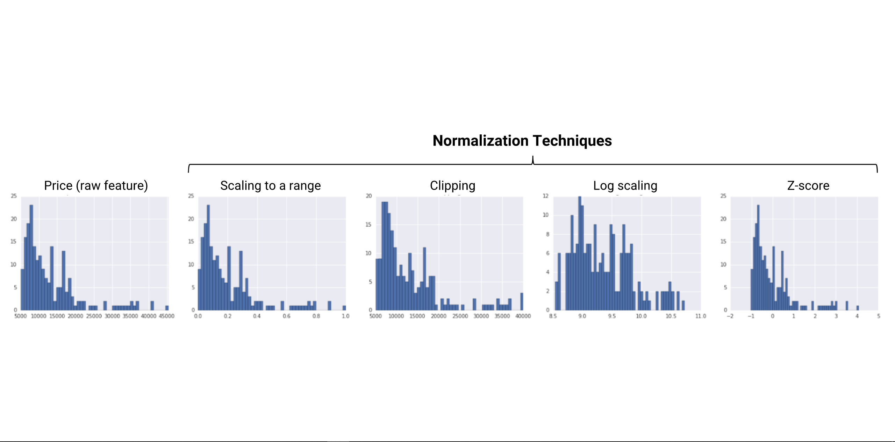
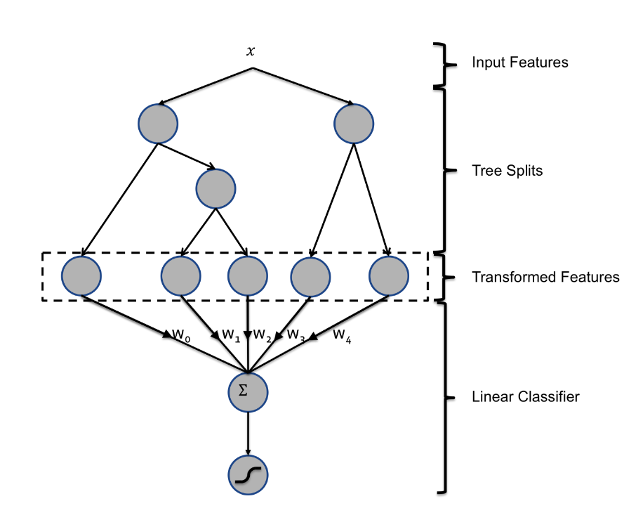

## Phase 5 Feature Engineering & Feature Selection

Original project link: https://www.kaggle.com/c/porto-seguro-safe-driver-prediction

### ❤️ Stage goals

#### Master the applicable scenarios and implementation methods of feature engineering

##### 5 major coding methods

- label encoding
- ordinal encoding
- onehot encoding
- target encoding 🔥🔥
- clustering encoding 🔥🔥

##### Data binning

- Unsupervised: equidistant, equal frequency
- Supervised: Chi-square, minimum entropy 🆕
- WOE/IV contribution 🆕

##### Data conversion

- scaling
- normalization
- clipping
- log scaling
- z-score

##### Feature Enhancement
- Feature interactions:
    - Polynomial construction
- Feature transformation
    - GBDT+LR
    
- Feature dimensionality reduction
    - pca
    - T-SNE

##### Feature selection

- Based on statistical indicators
    - Variance
    - Correlation
    - Gini Coefficient
    - Information gain
- Model based
    - tree model
    - RFE etc.